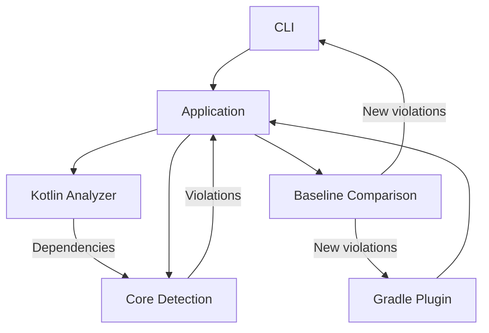

# Architecture Drift Detector

Architecture Drift Detector is a deterministic Kotlin/JVM developer tool for detecting dependencies that violate an intended software architecture.

It compares dependencies discovered in Kotlin source code with architecture rules defined in a small text configuration and reports violations with source file and line information.

The detector can be used from the command line or integrated into Gradle verification so architecture drift can fail a normal `check` build in CI.

For existing codebases that already contain known architecture violations, a baseline can capture the current drift so CI fails only when new drift is introduced.

## Quick start

Clone the repository and run the complete test suite:

```bash
git clone https://github.com/gelovI/architecture-drift-detector.git
cd architecture-drift-detector
./gradlew clean test
```

On Windows:

```powershell
git clone https://github.com/gelovI/architecture-drift-detector.git
cd architecture-drift-detector
.\gradlew.bat clean test
```

Run the detector against the clean example:

```powershell
.\gradlew.bat :drift-cli:run --args="architecture.drift examples\clean"
```

Expected result:

```text
No architecture drift detected.
```

Then run it against a project containing a forbidden dependency:

```powershell
.\gradlew.bat :drift-cli:run --args="architecture.drift examples\broken"
```

The command fails verification and reports the source location, violated rule, and dependency:

```text
examples\broken\OrderService.kt:6: forbidden dependency domain -> infrastructure: dev.shop.domain.order.OrderService -> dev.shop.infrastructure.Database
```

## Why

Software architecture can gradually diverge from its intended design as dependencies are introduced during development.

For example, an application may define a rule that the domain layer must not depend on infrastructure:

```text
domain -X-> infrastructure
```

but the implementation may contain:

```kotlin
package dev.shop.domain.order

import dev.shop.infrastructure.Database

class OrderService(
    private val database: Database,
)
```

Architecture Drift Detector makes that difference executable and measurable.

## Example diagnostic

A forbidden dependency is reported with its source location, violated rule, and dependency:

```text
Architecture drift detected:
src/main/kotlin/dev/shop/domain/order/OrderService.kt:6: forbidden dependency domain -> infrastructure: dev.shop.domain.order.OrderService -> dev.shop.infrastructure.Database
```

The result is deterministic and does not require an LLM.

## Architecture baselines

Existing projects may already contain architecture drift that cannot be removed immediately.

A baseline records the identities of known violations so they can be tolerated temporarily while newly introduced violations still fail verification.

For example:

```text
forbid domain -> infrastructure | dev.shop.domain.order.OrderService -> dev.shop.infrastructure.Database
```

A baseline identity contains:

```text
rule + source + target
```

Source file and line information are deliberately not part of the identity. Moving an existing violation to another line or file therefore does not turn it into new drift.

Baseline comparison is deterministic:

```text
detected violation in baseline     -> existing drift
detected violation not in baseline -> new drift
stale baseline entry               -> ignored
```

Stale entries do not create violations and are not removed automatically.

### Create a baseline with the CLI

A baseline can be generated from the drift currently detected in a Kotlin file or directory:

```powershell
.\gradlew.bat :drift-cli:run --args="baseline architecture.drift <kotlin-file-or-directory> architecture-drift.baseline"
```

The command exits successfully and writes a deterministic baseline containing the currently detected violations.

### Check only for new drift with the CLI

Use the generated baseline when checking a project:

```powershell
.\gradlew.bat :drift-cli:run --args="check architecture.drift <kotlin-file-or-directory> architecture-drift.baseline"
```

If every detected violation is already baselined, the command reports:

```text
No new architecture drift detected.
```

A violation that is not contained in the baseline is reported with its normal actionable diagnostic and causes a non-zero exit status.

## Architecture definition

Architecture rules are defined in `architecture.drift`.

Example:

```text
component domain dev.shop.domain
component infrastructure dev.shop.infrastructure

forbid domain -> infrastructure
```

This declares two architectural components based on package prefixes and forbids dependencies from `domain` to `infrastructure`.

The configuration format is intentionally minimal in the current version.

## Gradle integration

The Gradle plugin registers:

```text
architectureDriftCheck
```

and integrates it with Gradle's normal `check` lifecycle.

A project using the plugin can therefore run:

```bash
./gradlew check
```

On Windows:

```powershell
.\gradlew.bat check
```

A detected architecture violation fails the Gradle build.

### Configuration

By default, the plugin uses:

```text
architecture.drift
src/main/kotlin
```

Projects with a different layout can configure these paths:

```kotlin
architectureDrift {
    architectureFile.set(
        layout.projectDirectory.file("config/architecture.drift")
    )

    sourceDirectory.set(
        layout.projectDirectory.dir("src/main/kotlin")
    )

    baselineFile.set(
        layout.projectDirectory.file("architecture-drift.baseline")
    )
}
```

`baselineFile` is optional. Without it, every detected violation fails the check as before. When configured, violations contained in the baseline are tolerated and only new drift fails the build.

The task declares its architecture definition, source directory, and configured baseline as Gradle inputs and supports Gradle up-to-date checking. Changing the baseline invalidates the previous task result.

A local consumer example is available in:

```text
examples/gradle-plugin
```

The example resolves the unpublished plugin through a Gradle composite build and demonstrates a known domain -> infrastructure violation that is tolerated through architecture-drift.baseline.

## CLI

The detector can also be executed through the CLI module.

Example:

```powershell
.\gradlew.bat :drift-cli:run --args="architecture.drift examples\clean"
```

A clean project exits successfully and reports:

```text
No architecture drift detected.
```

A project containing a forbidden dependency reports the violation and exits with a non-zero status.

Example:

```powershell
.\gradlew.bat :drift-cli:run --args="architecture.drift examples\broken"
```

## Modules

The project is split into explicit architectural responsibilities:

```text
drift-core
    ^
    |
drift-analyzer-kotlin
    ^
    |
drift-application
    ^             ^
    |             |
drift-cli    drift-gradle-plugin
```

### Detection flow



The Kotlin analyzer discovers dependencies from source code using PSI. It does not decide whether those dependencies violate the intended architecture.

Architecture rules and deterministic violation detection belong to the core. The application layer orchestrates source analysis and applies optional baseline comparison before results reach the CLI or Gradle plugin.

This separation keeps source-analysis concerns, architecture policy, baseline workflow, and delivery mechanisms independently testable.

### `drift-core`

Contains the architecture model, dependency model, rules, violations, and deterministic drift detection.

It does not know how source code is analyzed or how results are delivered to users.

### `drift-analyzer-kotlin`

Analyzes Kotlin source code using Kotlin PSI and discovers dependencies.

Source analysis is deliberately separated from architecture-rule evaluation.

### `drift-application`

Orchestrates architecture loading, Kotlin source analysis, directory traversal, and drift detection for delivery adapters.

### `drift-cli`

Provides command-line delivery and diagnostic formatting.

### `drift-gradle-plugin`

Provides Gradle integration through a typed extension and `architectureDriftCheck` verification task.

## Requirements

- Java 17 or newer
- Gradle 8.14 through the included Gradle Wrapper

The project is implemented with Kotlin/JVM 2.2.21.

## Build and test

Run the complete test suite:

```powershell
.\gradlew.bat clean test
```

On Unix-like systems:

```bash
./gradlew clean test
```

The project includes unit tests, analyzer characterization tests, CLI tests, and Gradle TestKit functional tests.

## Kotlin analysis capabilities

The Kotlin analyzer is currently syntactic and PSI-based. It does not perform full semantic symbol resolution.

Supported scenarios and known limitations are documented in:

- `docs/kotlin-analysis-capabilities.md`

In particular, semantic cases such as wildcard imports and type aliases are intentionally not approximated with heuristics.

## Design decisions

Architectural decisions are recorded as ADRs:

1. `docs/adr/0001-separate-detection-from-source-analysis.md`
2. `docs/adr/0002-use-kotlin-psi-for-source-analysis.md`
3. `docs/adr/0003-use-minimal-text-format-for-architecture-definition.md`
4. `docs/adr/0004-add-source-context-to-drift-violations.md`
5. `docs/adr/0005-integrate-architecture-drift-with-gradle-verification.md`
6. `docs/adr/0006-baseline-existing-architecture-drift.md`

Known technical debt is documented in:

- `docs/technical-debt.md`

## Current scope

The current version focuses on deterministic detection of forbidden dependencies in Kotlin/JVM projects.
It supports baselining existing violations so teams can introduce architecture verification incrementally and fail CI only for newly introduced drift.

Deliberately deferred areas include:

- semantic Kotlin symbol resolution
- wildcard import resolution
- type-alias resolution
- advanced multi-project Gradle configuration
- richer architecture-rule DSLs
- AI-generated explanations or remediation

These are kept outside the core detection path so the current detector remains deterministic and testable.

## Releases

- `v1.0.0` - first end-to-end architecture drift detection
- `v2.0.0` - actionable deterministic diagnostics with source context
- `v3.0.0` - Gradle/CI integration
- `v4.0.0` - architecture drift baselines for incremental adoption
